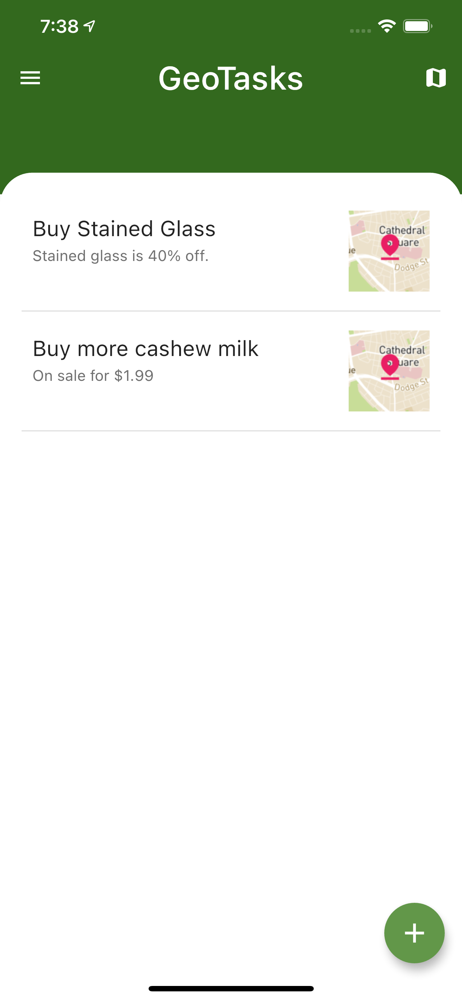
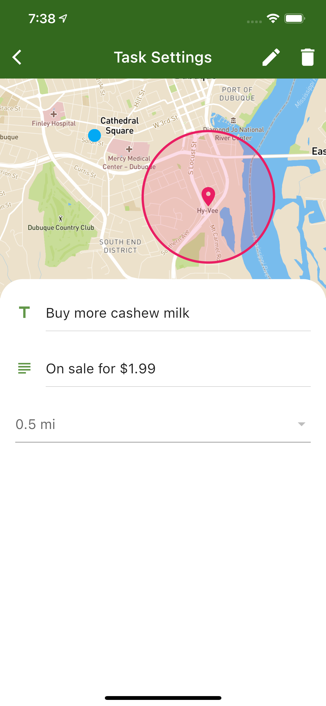

# GeoTasks

Location-based reminders app for people on the go.

  
  

## Background

GeoTasks is a mobile app that I started building to solve a problem I experienced
during my last semester of college. I was commuting to campus and frequently thought
to myself, 'Next time I drive by the grocery store, I need to buy eggs', or 'Next time
I drive by the gas station, I should fill up.' But, after a long day of classes,
I would forget about those things I told myself to do on my commute home. Thus, GeoTasks
was born.

A typical use case for GeoTasks would be the following:
- While Jane is making breakfast before leaving for work, she realizes she needs to buy
more eggs and milk for her breakfast the next day. She opens GeoTasks on her mobile device,
creates a new task, sets the title to "Buy more eggs and milk", sets the location to a
grocery store that is on her commute home from work, and sets the notification radius to 1 mile.
Next time she is within one mile of the grocery store, she will receive a notification for her task.

## Roadmap

1. Do testing to ensure that when a user moves within the notification radius of
one of their tasks, they receive a notification.
2. Implement a push notification style notification rather than an alert dialog.
3. Implement a background task that monitors the users location since the app
only supports location change detection while the app is open.
4. Streamline the process for specifying the location of a task by implementing
geocoding and location search (similar to the location search in Google Calendar).
5. Implement time ranges for task notifications (e.g., If a user only wants to be
notified about a task between 3-8PM).
